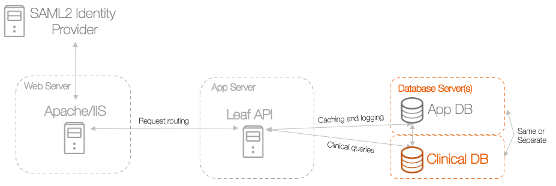

# 1 - Create App Database

 

1. Create a database to serve as the Leaf application database. This can be as simple as:

    ```sql
    CREATE DATABASE LeafDB 
    ```

    !!! tip
        We also recommend also **creating a Leaf-specific SQL service account and password** for the API to use, though this isn't a requirement


2. Populate the database `tables`, `stored procedures`, and `functions` using the <a href="https://github.com/uwrit/leaf/blob/master/src/db/build/LeafDB.Schema.sql" target="_blank">LeafDB.Schema.sql</a> script.

3. Populate the initialization data using the <a href="https://github.com/uwrit/leaf/blob/master/src/db/build/LeafDB.Init.sql" target="_blank">LeafDB.Init.sql</a> script.

4. Grant your account permissions for the application database:

    ```sql
    /* If using a service account - Optional but Recommended! */
    CREATE LOGIN <your_account> WITH PASSWORD = '<your_pass>'
 
    USE LeafDB
    GO

    CREATE USER <your_account> FOR LOGIN <your_account>

    GRANT SELECT,UPDATE,INSERT,DELETE,EXEC ON SCHEMA :: app TO <your_account>;
    GRANT SELECT,UPDATE,INSERT,DELETE,EXEC ON SCHEMA :: network TO <your_account>;
    GRANT SELECT,UPDATE,INSERT,DELETE,EXEC ON SCHEMA :: adm TO <your_account>;
    GRANT SELECT,UPDATE,INSERT,DELETE,EXEC ON SCHEMA :: auth TO <your_account>;
    GRANT SELECT,UPDATE,INSERT,DELETE,EXEC ON SCHEMA :: ref TO <your_account>;
    GRANT SELECT,UPDATE,INSERT,DELETE,EXEC ON SCHEMA :: rela TO <your_account>;

    /* If on Windows */
    GRANT ADMINISTER BULK OPERATIONS TO <your_account>;

    /* Else if on Linux */
    ALTER SERVER ROLE [sysadmin] ADD MEMBER <your_account>;
    ```

5. Populate the <a href="https://www.cms.gov/Medicare/Coding/ICD10/2018-ICD-10-CM-and-GEMs.html" target="_blank">CMS General Equivalence Mapping (GEMs)</a> data using the <a href="https://github.com/uwrit/leaf-scripts/blob/master/GEMs/LeafDB.GEMs.sql" target="_blank">LeafDB.GEMs.sql</a> script. These allow the Concept search box to suggest ICD10 -> ICD9 or ICD9 -> ICD10 equivalents if users search for a specific ICD10/9 code.

<br>
Next: [Step 2 - Configure App Server](../2_app_server)