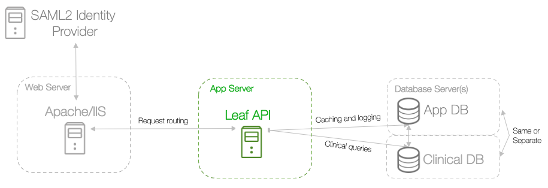

# 3 - Create a JWT Signing Key

 

The Leaf client and server communicate by <a href="https://jwt.io/introduction/" target="_blank">JSON Web Tokens, or JWTs</a> (pronounced "JAH-ts"). In a terminal, start by creating a JWT signing key. This allows the JWT recipient to verify the sender is who they say they are.

**On the app server**, run:

```bash
$ mkdir /var/opt/leafapi/keys
$ openssl req -nodes -x509 -newkey rsa:2048 -keyout /var/opt/leafapi/keys/key.pem \
    -out /var/opt/leafapi/keys/cert.pem -days 3650 -subj \
    "/CN=urn:leaf:issuer:leaf.<your_institution>.<tld>"
```
```bash
$ openssl pkcs12 -in /var/opt/leafapi/keys/cert.pem -inkey key.pem \
    -export -out /var/opt/leafapi/keys/leaf.pfx -password pass:<your_pass>
```

Note that the output paths and password can be whatever you'd like, and you'll need to reference them in the environment variables at a later step.

!!! warning "Be sure that the key.pem file and path are readable by the (service) account which will be running the Leaf API"


At this point, your Leaf directory on the app server should look similar to this:

```
var
├── opt
│   ├── leafapi
│   │   ├── keys                 # JWT signing key
│   │   |   ├── cert.pem         ##########################
│   │   |   ├── key.pem          # Signing key & cert
│   │   |   ├── leaf.pfx         ##########################
│   │   ├── api                  # Compiled API
│   │   ├── leaf_download        # Downloaded source files 
├── log
│   ├── leaf                     # Log files
```

<br>
Next: [Step 4 - Compile the Leaf API](../4_compile_api)