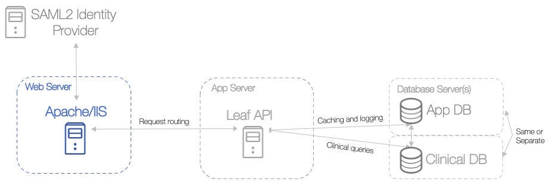

# 8a - Configure Leaf with Apache

In general, Leaf works quite well when deployed with Apache. In this section, we'll:

1. Deploy the Leaf API on the app server.
2. Host the Leaf client using Apache on the web server.

## Deploying the API as a Service

 

We'll start by deploying the Leaf API as a service using `systemctl`.

!!! info "Once built, the API service should be run with a service account that is not an administrative user"

!!! info "The API host firewall will need to allow inbound communication on the chosen port to the Apache web server"

**On the app server**:

1. Create a nologin user account to isolate the service from the operating system, and give that account ownership over the API -related folders.

    ```sh
    useradd -r api_svc_account
    mkdir /var/log/leaf/
    chown api_svc_account /var/log/leaf/
    chown -R api_svc_account /var/opt/leafapi/
    ```

2. Create a service file for the API instance. The `WorkingDirectory` must be the directory where `API.dll` resides.

    **`/var/opt/leafapi/services/leaf_api.service`**

    ```
    [Unit]
    Description=Leaf API Service

    [Service]
    EnvironmentFile=/var/opt/leafapi/services/leaf_api.service.conf
    User=api_svc_account
    Type=idle
    TimeoutStartSec=300
    TimeoutStopSec=30
    WorkingDirectory=/var/opt/leafapi/api/
    ExecStart=/usr/bin/dotnet API.dll 

    [Install]
    WantedBy=multi-user.target
    ```

3. Last, link your service file with `systemd` and make it aware of the service:

    ```sh
    # Create a symbolic link into the systemd directory
    ln -s /var/opt/leafapi/services/leaf_api.service /etc/systemd/system/leaf_api.service

    # Make the systemd aware of the service
    systemctl daemon-reload

    # Start the service
    systemctl start leaf_api.service
    ```

## Hosting Leaf with Apache

 

Great, at this point the Leaf database and API should be up and running.
The status of the Leaf API can be checked with this command:

    ```sh
    systemctl status leaf_api.service
    ```

1. **From the app server**, copy the `/build` directory made in [Step 5 - Build the Leaf UI](../5_compile_client) to `/data/www/` **on the web server**. This will copy the Leaf Client production files over for Apache to host.

2. **On the web server**, define an `httpd.conf` file to host a single node in a Leaf deployment. 

    !!! info 
        Each Leaf client webapp must be hosted at the top level of the `DocumentRoot` of an Apache VirtualHost. Multiple nodes could be hosted on a single Apache instance pointing at that same `DocumentRoot`, however each would need its own VirtualHost and unique DNS name defined (e.g., site1.leaf.school.edu, site2.leaf.school.edu).

    In the below example, the Shibboleth module is used to authenticate users via SAML2 and provide group membership to the app. If you want to define your own set of groups that limit access to the app via Apache (i.e. during pre-release or evaluation), you can define your own Apache groups via the AuthGroupFile directive and then require those groups.

**`httpd.conf`**

```xml
<VirtualHost *:443>

    ServerName leaf.{subdomain}.{domain}.{tld}
    ServerAlias leaf
    DocumentRoot /data/www
    HostnameLookups Off
    ErrorLog logs/leaf_ssl_error_log
    CustomLog logs/leaf_ssl_access_log combinedio

    SSLEngine on
    SSLProtocol all -SSLv2 -SSLv3
    SSLHonorCipherOrder on
    SSLCipherSuite HIGH:!aNULL:!MD5:!AECDH:!ADH
    SSLCertificateFile /etc/pki/tls/certs/{leaf-cert}.cert
    SSLCertificateKeyFile /etc/pki/tls/private/{leaf-key}.key
    SSLCertificateChainFile /etc/pki/tls/certs/{cert-chain}.cert

    SetEnvIf User-Agent ".*MSIE.*" \
        nokeepalive ssl-unclean-shutdown \
        downgrade-1.0 force-response-1.0

    <Files *.sso>
        SetHandler shib-handler
    </Files>

    <Location />

      <RequireAny>

        # Optional subnet restriction
        Require ip {restricted-subnet}

        # Authentication provider Setup
        AuthType shibboleth
        ShibRequireSession On
        ShibUseHeaders On
        Require shibboleth

        # optional users restriction, although this only determines access to the app, not a user's underlying authorization within the app
        # cat /data/leaf/users.conf --> leafusers: eppns...
        AuthGroupFile /data/leaf/users.conf
        require group leafusers

      </RequireAny>

    </Location>

    # API proxy directive, overall api doesn't require user session

    <Location /api>
      ProxyPass         http://{node1-ip}:{node1-port}/api
      ProxyPassReverse  http://{node1-ip}:{node1-port}/api
      
        <RequireAny>
            AuthType shibboleth
            ShibRequireSession Off 
		    Require shibboleth
         </RequireAny>

    </Location>

  # /api/user does require user session
    <Location /api/user>
         <RequireAny>
               AuthType shibboleth
               ShibRequireSession On
		       Require shibboleth
         </RequireAny>
 </Location>

</VirtualHost>
```


## SELinux and Apache
If you have SELinux enabled on your system, you need to be aware of an additional set of controls specifically related to running Apache.

By default with SELinux enabled httpd connections to other apps not located on localhost are regulated. If your API server is located on another host you will need to enable httpd to make outbound connections.

To enable httpd connections to non-standard ports: 

```bash
$ setsebool -P httpd_can_network_connect on
```

Depending on which ports you use for your API service you may need enable other booleans (ie httpd_can_network_connect_db, httpd_use_openstack). To see the complete list of variables on your system and their present status:

```bash
$ getsebool -a  | grep httpd
```

If you decide to use non-standard directory to host your webapp you will also need to re-label the files in that directory so that httpd can properly access the webapp files. Using the location in the example above:

```bash
$ semanage fcontext -a -t httpd_sys_content_t "/data/www(/.*)?"
$ restorecon -R -v /data/www
```

<br>
Next: [Step 9 - Configure Authentication with SAML2](../9_saml2)